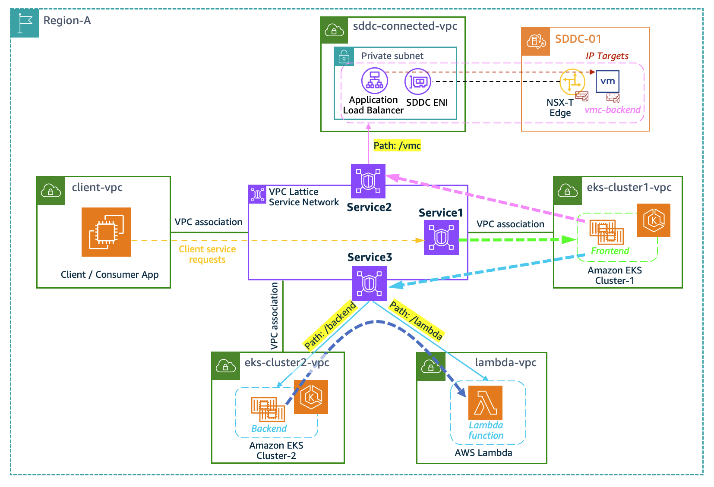
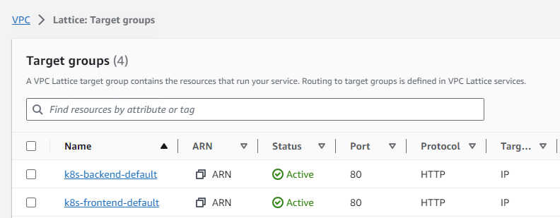
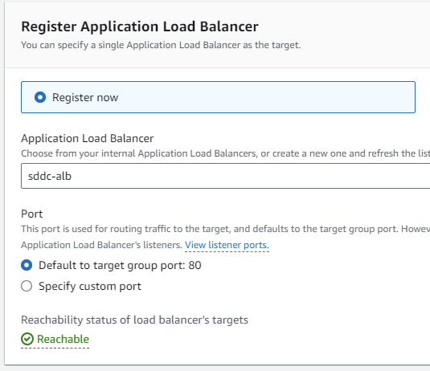
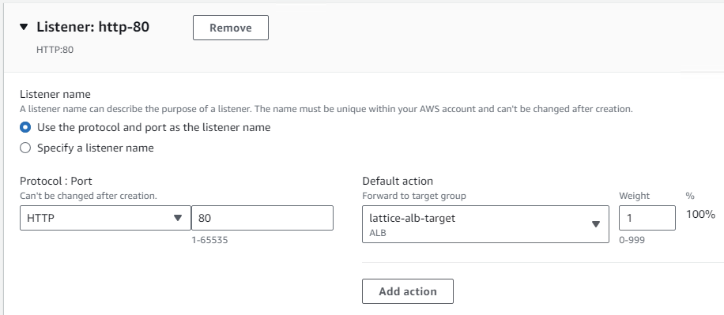
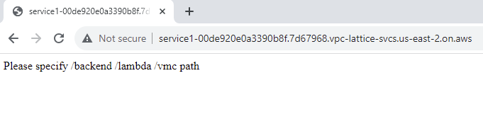
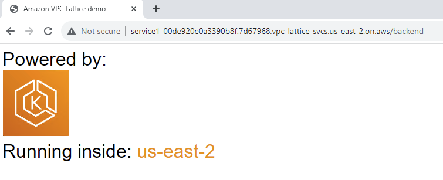
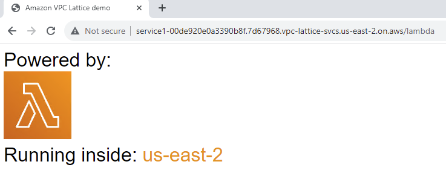

# Amazon VPC Lattice - Build a distributed app using Amazon EKS, Lambda and VMware Cloud on AWS

This repository contains sample code to deploy an application layer network using [Amazon VPC Lattice](https://aws.amazon.com/vpc/lattice/). 
You will find several applications hosted in [Amazon EKS](https://aws.amazon.com/eks/), [AWS Lambda](https://aws.amazon.com/lambda/), and [VMware Cloud on AWS](https://aws.amazon.com/vmware/). 
You will connect them using Amazon VPC Lattice with the following architecture.



## Demo design points
* **frontend** service renders the main page, and based on the request path (backend/lambda/vmc) it will display which AWS service is running at backend, as well as the AWS Region or VMC SDDC details.  
* The Lambda function retrieves the current AWS Region, and the **vmc-backend** service retrieves the running SDDC details.

* client (consumer app) will access the **frontend** service (runnning on EKS cluster1) via Lattice **Service1**.
* **frontend** service will access **backend** service (running on EKS cluster2) via Lattice **Service3** on path "/backend".
* **backend** service will need to access lambda via Lattice **Service3** on path "/lambda" to get the AWS Region. 
* **frontend** service can also access lambda directly via Lattice **Service3** on path "/lambda".
* **frontend** service will access **vmc-backend** service (runnig on SDDC) via Lattice **Service2** on path "/vmc".

* Each service is deployed in its own VPC, which can belong to the same or different AWS accounts. 
* EKS-Cluster1 VPC and EKS-Cluster2 VPC are using overlapping CIDR. This is intential to showcase VPC Lattice can solve IP confilicting issues since it uses an unique link-local address range. 

&nbsp;   &nbsp;  


## Prerequisites

* AWS Account(s) with IAM user(s) with appropriate permissions. The deployment instructions are agnostic to single or multiple AWS Account - follow the pattern you like to test.
* [AWS CLI](https://aws.amazon.com/cli/) installed - for the deployment of VPC Lattice resources and applications using [AWS CloudFormation](https://aws.amazon.com/cloudformation/).
* `eksctl` and `kubectl` installed - for the deployment of EKS applications.
* Remember to use an AWS Region where VPC Lattice is supported.
* Deploy a VMware Cloud on AWS SDDC with a Connected VPC at the same region as the VPC Lattice service network. 

&nbsp;   &nbsp;  

## Deployment

Before start with the deployment, let's define some variables we'll use during the deployment:

```bash 
export AWS_REGION=ap-southeast-2
export SERVICE_NETWORK_NAME=service-network
export CLUSTER1_NAME=cluster1
export CLUSTER2_NAME=cluster2
```

### Create Amazon VPC Lattice Service Network

First, we create the Service Network - central piece in our service-to-service communication. We have this resource defined in the [lattice-service-network](./vpc-lattice/lattice-service-network.yaml) file, so the only thing we need is deploy that AWS CloudFormation template:

```bash
aws cloudformation deploy --stack-name service-network --template-file ./vpc-lattice/lattice-service-network.yaml --region $AWS_REGION --parameter-overrides ServiceNetworkName=$SERVICE_NETWORK_NAME  --capabilities CAPABILITY_IAM --no-fail-on-empty-changeset

export SERVICE_NETWORK_ID=$(aws cloudformation describe-stacks --stack-name service-network --query 'Stacks[0].Outputs[?OutputKey == `ServiceNetworkID`].OutputValue' --output text --region $AWS_REGION)
```

### Create the application hosted in the AWS Lambda function

Next application is the one hosted in the Lambda function. You will find the definition of the resources in the [app-lambda](./applications/app-lambda.yaml) file. You will see that in addition to the Lambda function, resources for a VPC to place the Lambda are also created. As in our example, the Lambda function is only consumed, we are giving you all the resources needed in case you want also to consume any other application from the function itself.

```bash
aws cloudformation deploy --stack-name lambda-application --template-file ./applications/app-lambda.yaml --region $AWS_REGION --capabilities CAPABILITY_IAM --no-fail-on-empty-changeset
```

### Create EKS applications and deploy the AWS Gateway API controller

Now we need to create two Amazon EKS clusters using `eksctl`. Remember that the names of those clusters were already defined at the beginning:

```bash
eksctl create cluster $CLUSTER1_NAME --region=$AWS_REGION --enable-ssm=true --node-private-networking=true
aws eks update-kubeconfig --name $CLUSTER1_NAME --alias cluster1

eksctl create cluster $CLUSTER2_NAME --region=$AWS_REGION --enable-ssm=true --node-private-networking=true
aws eks update-kubeconfig --name $CLUSTER2_NAME --alias cluster2
```

Once we are our clusters deployed, is time to **deploy the Gateway API controller**. The first step is to create an IAM policy (you fill find its definition in the [recommended-inline-policy.json](./vpc-lattice/controller/recommended-inline-policy.json) file) that can invoke the gateway API. Once we have it created, we export its ARN - as we will need it later.

```bash
aws iam create-policy \
--policy-name VPCLatticeControllerIAMPolicy \
--policy-document file://vpc-lattice/controller/recommended-inline-policy.json

export VPCLatticeControllerIAMPolicyArn=$(aws iam list-policies --query 'Policies[?PolicyName==`VPCLatticeControllerIAMPolicy`].Arn' --output text)
```

Also, we will need to update the Security Groups used by our clusters to receive traffic from the VPC Lattice fleet. To simplify this configuration, we will make use of the VPC Lattice [managed prefix list](https://docs.aws.amazon.com/vpc/latest/userguide/managed-prefix-lists.html) - make sure you use the prefix list ID of the AWS Region you are using. Before configuring this entry in the Security Groups, let's get the CIDR blocks from the managed prefix list. See [Control traffic to resources using security groups](https://docs.aws.amazon.com/vpc/latest/userguide/VPC_SecurityGroups.html) for more information.

```bash
export PREFIX_LIST_ID=$(aws ec2 describe-managed-prefix-lists --query "PrefixLists[?PrefixListName=="\'com.amazonaws.$AWS_REGION.vpc-lattice\'"].PrefixListId" | jq -r '.[]')
export MANAGED_PREFIX=$(aws ec2 get-managed-prefix-list-entries --prefix-list-id $PREFIX_LIST_ID --output json  | jq -r '.Entries[0].Cidr')
```

Time to deploy the gateway controller. Let's start with **cluster1**. We'll perform the following actions:

* Obtain the Security Group used by the cluster and update it allowing the traffic to the VPC Lattice CIDR block (information obtained above).
* Create the `system` namespace.
* Create an `iamserviceaccount` for pod level permission.
* Deploy the VPC Lattice Controller.
* Create the `amazon-vpc-lattice` GatewayClass.

```bash
kubectl config use-context cluster1

export CLUSTER1_SG=$(aws eks describe-cluster --name $CLUSTER1_NAME | jq -r '.cluster.resourcesVpcConfig.clusterSecurityGroupId')

aws ec2 authorize-security-group-ingress --group-id $CLUSTER1_SG --cidr $MANAGED_PREFIX --protocol -1

eksctl utils associate-iam-oidc-provider --region=${AWS_REGION} --cluster=${CLUSTER1_NAME} --approve

kubectl apply -f ./aws-application-networking-k8s/examples/deploy-namesystem.yaml

eksctl create iamserviceaccount \
   --cluster=$CLUSTER1_NAME \
   --namespace=aws-application-networking-system \
   --name=gateway-api-controller \
   --attach-policy-arn=$VPCLatticeControllerIAMPolicyArn \
   --override-existing-serviceaccounts \
   --region $AWS_REGION \
   --approve

kubectl apply -f ./aws-application-networking-k8s/examples/deploy-v0.0.14.yaml
kubectl apply -f ./aws-application-networking-k8s/examples/gatewayclass.yaml

```

We proceed the same, but now with **cluster2**:

```bash
kubectl config use-context cluster2

export CLUSTER2_SG=$(aws eks describe-cluster --name $CLUSTER2_NAME | jq -r '.cluster.resourcesVpcConfig.clusterSecurityGroupId')

aws ec2 authorize-security-group-ingress --group-id $CLUSTER2_SG --cidr $MANAGED_PREFIX --protocol -1

eksctl utils associate-iam-oidc-provider --region=${AWS_REGION} --cluster=${CLUSTER2_NAME} --approve

kubectl apply -f ./aws-application-networking-k8s/examples/deploy-namesystem.yaml

eksctl create iamserviceaccount \
   --cluster=$CLUSTER2_NAME \
   --namespace=aws-application-networking-system \
   --name=gateway-api-controller \
   --attach-policy-arn=$VPCLatticeControllerIAMPolicyArn \
   --override-existing-serviceaccounts \
   --region $AWS_REGION \
   --approve


kubectl apply -f ./aws-application-networking-k8s/examples/deploy-v0.0.14.yaml
kubectl apply -f ./aws-application-networking-k8s/examples/gatewayclass.yaml
```

With this, it's time to create the EKS applications. However, before that, let's deploy the VPC Lattice Services - as we will need some of their domain names to configure these applications.

### Create VPC Lattice Services

As we have a mix of technologies for our applications, we are going to create the VPC Lattice Services (and listeners) using CloudFormation, while the different target groups will be created either using CloudFormation or `kubectl`. Let's start with the Lattice Services. You will find the definition of the resources in the [lattice-services.yaml](./vpc-lattice/lattice-services.yaml) file.

```bash
aws cloudformation deploy --stack-name lattice-services --template-file ./vpc-lattice/lattice-services.yaml --region $AWS_REGION --parameter-overrides ServiceNetwork=$SERVICE_NETWORK_ID --capabilities CAPABILITY_IAM --no-fail-on-empty-changeset
```

### Create EKS "frontend" and "backend" applications

Now that we have the Lattice Services created (still without routing configuration), we can point to the corresponding services within our EKS applications:

* Replace the **LATTICE_URL** with **Service3** domain name, and **LATTICE_URL2** with the **Service2** domain name inside the [front-end.yaml](./applications/apps-eks/kubernetes/front-end.yaml)
* Replace the **LATTICE_URL** with **Service3** domain name inside the [back-end.yaml](./applications/apps-eks/kubernetes/back-end.yaml) 

We are ready to deploy the `frontend` and `backend` applications:

```bash
kubectl config use-context cluster1
kubectl apply -f ./applications/apps-eks/kubernetes/front-end.yaml

kubectl config use-context cluster2
kubectl apply -f ./applications/apps-eks/kubernetes/back-end.yaml
```

### Create VPC Lattice Target Groups and service routing

We have our applications ready, and VPC Lattice Service Network and Services deployed, it's time to create all the routing to communicate our applications. Let's start creating the target groups:

* First, we will export both the `frontend` and `backend` applications to make them available as VPC Lattice targets.

```bash
kubectl config use-context cluster1
kubectl apply -f ./vpc-lattice/routes/frontend-export.yaml

kubectl config use-context cluster2
kubectl apply -f ./vpc-lattice/routes/backend-export.yaml
```

Within the AWS Conosole, you should see the two EKS services are exported to VPC Lattice as the service target groups. 


* Since the two EKS services require access to other Lattice services, we'll also need to associate their VPCs to the Lattice Service Network.

```bash
export Cluster1VpcID=$(aws ec2 describe-vpcs --filters Name=tag:Name,Values=eksctl-$CLUSTER1_NAME-cluster/VPC --region $AWS_REGION | jq -r '.Vpcs[0].VpcId')
export Cluster2VpcID=$(aws ec2 describe-vpcs --filters Name=tag:Name,Values=eksctl-$CLUSTER2_NAME-cluster/VPC --region $AWS_REGION | jq -r '.Vpcs[0].VpcId')

aws cloudformation deploy --stack-name lattice-eks-vpc-associations --template-file ./applications/eks-vpc-associations.yaml --region $AWS_REGION --parameter-overrides Cluster1VpcID=$Cluster1VpcID Cluster1SG=$CLUSTER1_SG Cluster2VpcID=$Cluster2VpcID Cluster2SG=$CLUSTER2_SG ServiceNetwork=$SERVICE_NETWORK_ID --capabilities CAPABILITY_IAM --no-fail-on-empty-changeset
```

* Next, we will create the Lambda service target.
```bash
export LambdaArn=$(aws cloudformation describe-stacks --stack-name lambda-application --query 'Stacks[0].Outputs[?OutputKey == `LambdaArn`].OutputValue' --output text --region $AWS_REGION)

aws cloudformation deploy --stack-name lattice-targets --template-file ./vpc-lattice/lattice-targetgroups-lambda.yaml --region $AWS_REGION --parameter-overrides ServiceNetwork=$SERVICE_NETWORK_ID LambdaArn=$LambdaArn --capabilities CAPABILITY_IAM --no-fail-on-empty-changeset
```


* And finally, we will create all the service routing configuration using CloudFormation.
```bash
export SERVICE1=$(aws cloudformation describe-stacks --stack-name lattice-services --query 'Stacks[0].Outputs[?OutputKey == `Service1`].OutputValue' --output text --region $AWS_REGION)
export SERVICE2=$(aws cloudformation describe-stacks --stack-name lattice-services --query 'Stacks[0].Outputs[?OutputKey == `Service2`].OutputValue' --output text --region $AWS_REGION)
export SERVICE3=$(aws cloudformation describe-stacks --stack-name lattice-services --query 'Stacks[0].Outputs[?OutputKey == `Service3`].OutputValue' --output text --region $AWS_REGION)

export TARGETCLUSTER1={**TARGET_GROUP_ARN**}
export TARGETCLUSTER2={**TARGET_GROUP_ARN**}
export TARGETLAMBDA=$(aws cloudformation describe-stacks --stack-name lattice-targets --query 'Stacks[0].Outputs[?OutputKey == `LatticeLambdaTarget`].OutputValue' --output text --region $AWS_REGION)

aws cloudformation deploy --stack-name lattice-routing --template-file ./vpc-lattice/lattice-routes.yaml --region $AWS_REGION --parameter-overrides Service1=$SERVICE1 Service2=$SERVICE2 Service3=$SERVICE3 TargetGroupCluster1=$TARGETCLUSTER1 TargetGroupCluster2=$TARGETCLUSTER2 TargetGroupLambda=$TARGETLAMBDA --capabilities CAPABILITY_IAM --no-fail-on-empty-changeset
```

&nbsp;   &nbsp;  

### Deploy VMC backend service and integrate it into Service Network. 

* Now we will deploy the VMC backend service onto VMs running on SDDC, and integrate it to the Lattice sercie network. First, deploy the (containerized) VMC backend service onto the Linux VMs running on the SDDC.

```bash
export VMC_API_TOKEN={}
export VMC_ORG_ID={}
export VMC_SDDC_ID={}

sudo docker login
sudo docker pull schen13912/vmc-backend:latest
sudo docker run --rm -ti -d  -p  3000:3000 -e VMC_API_TOKEN=$VMC_API_TOKEN -e VMC_ORG_ID=$VMC_ORG_ID -e VMC_SDDC_ID=$VMC_SDDC_ID schen13912/vmc-backend:latest 
```
* Within the Connected VPC, create a **Internal** Application Load Balncer, and register the VM workloads (running VMC backend services) as remote IP targets.  

* Next, create a Lattice Target Group using the ALB as a target. 


* Finally, add a Http Listner to **Service2** forwarding to the ALB target group. 



&nbsp;   &nbsp;   &nbsp;


## Testing Connectivity

Everything is created! Now we have all our applications either consuming or providing its services via VPC Lattice. So it's time to check that we can indeed consume those applications.

Let's start checking if **frontend (cluster1) can consume both backend (cluster2) and the Lambda function**. Port-forward the frontend application (so it will be visible in your browswer as localhost:8080):

```
kubectl config use-context cluster1
kubectl port-forward svc/frontend 8080:80
```



If you use the path */backend*, we are calling the *backend* application hosted in *cluster2*. The *backend* application will also the Lambda function to retrieve the AWS Region where the application is located. You will see in your browser the following:



If you use the path */lambda*, *cluster1* is calling directly the Lamba function to get the AWS Region. You will see in your browser the following:



* EKS cluster1 is talking directly to the Lambda function.


&nbsp;   &nbsp;   &nbsp;


## Clean-up

* Delete Amazon VPC Lattice routes, target groups, services, and VPC associations using CloudFormation

```bash
aws cloudformation delete-stack --stack-name lattice-routing --region $AWS_REGION
aws cloudformation delete-stack --stack-name lattice-eks-vpc-associations --region $AWS_REGION
aws cloudformation delete-stack --stack-name lattice-targets --region $AWS_REGION
aws cloudformation delete-stack --stack-name lattice-services --region $AWS_REGION
```

* Delete VPC Lattice resources created using EKS.

```bash 
kubectl config use-context cluster1
kubectl delete -f vpc-lattice/routes

kubectl config use-context cluster2
kubectl delete -f vpc-lattice/routes


eksctl delete iamserviceaccount --name=gateway-api-controller --cluster=${CLUSTER1_NAME} --region=${AWS_REGION} --namespace=system
eksctl delete iamserviceaccount --name=gateway-api-controller --cluster=${CLUSTER1_NAME} --region=${AWS_REGION} --namespace=system
aws iam delete-policy --policy-arn ${VPCLatticeControllerIAMPolicyArn}
```

* Delete EKS cluster1 and cluster2 via `eksclt` and the Lambda function via CloudFormation

```bash
eksctl delete cluster --name=${CLUSTER1_NAME} --region=${AWS_REGION}
eksctl delete cluster --name=${CLUSTER2_NAME} --region=${AWS_REGION}
aws cloudformation delete-stack --stack-name lambda-application --region $AWS_REGION
```

* Delete VPC Lattice Service Network

```bash
aws cloudformation delete-stack --stack-name service-network --region $AWS_REGION
```


## References

* [Introducing Amazon VPC Lattice](https://d1.awsstatic.com/events/Summits/reinvent2022/NET215_NEW-LAUNCH!-Introducing-Amazon-VPC-Lattice-Simplifying-application-networking.pdf).
* [Build secure multi-account multi-VPC connectivity for your applications with Amazon VPC Lattice](https://aws.amazon.com/blogs/networking-and-content-delivery/build-secure-multi-account-multi-vpc-connectivity-for-your-applications-with-amazon-vpc-lattice/)
* [Simplify Application Networking with Amazon VPC Lattice and VMware Cloud on AWS](https://aws.amazon.com/blogs/apn/simplify-application-networking-with-amazon-vpc-lattice-and-vmware-cloud-on-aws/)